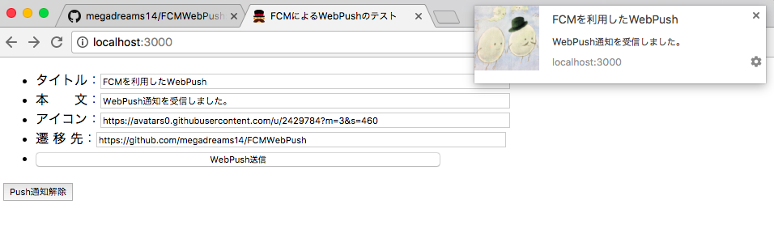
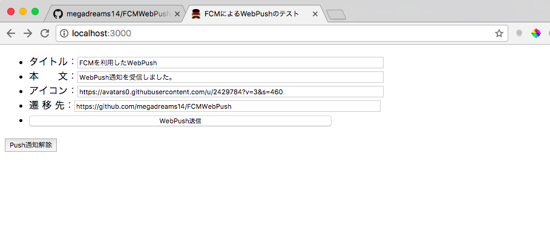
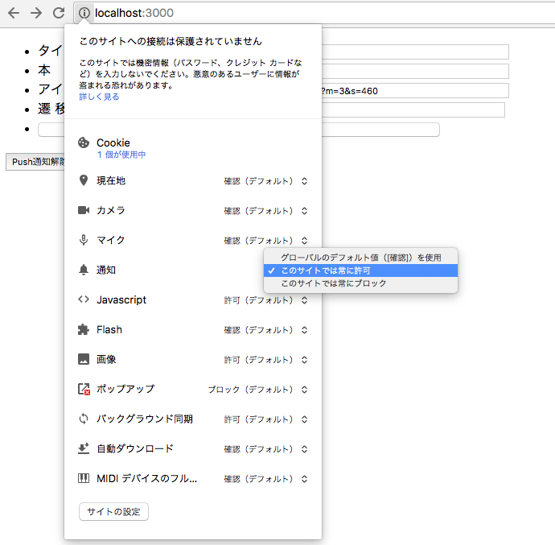

# FCMWebPush
FCMを利用したWebPushをnodejsを用いて実装したサンプルプロジェクトです。




## 動作環境

| 対象          | Version  |
| :-----------: |:-------------:|
| OS            | macOS Sierra ver 10.12.3 |
| Node.js       | 7.6.0 |
| Google Chrome | 58.0.3029.81 |

## ローカル環境構築

* レポジトリの取得
   
   ```
   git clone https://github.com/megadreams14/FCMWebPush.git
   ```

* Node.jsのバージョン指定
   ```
   nvm use v7.6.0
   ```
   * nvmをインストールされていない方は下記記事を参考
      * [Macにnvm + Node.jsをインストールする](http://qiita.com/dribble13/items/e895208727c85ef9bc52)
      
* ライブラリのインストール
   ```
   npm install
   ```

* サーバの起動
   ```
   node server.js
   ```

* ブラウザでアクセス

   http://localhost:3000/send/webpush

* WebPush通知送信の設定



* 注意
   * Node.jsのサーバを再起動すると認証用の鍵が再生されるため、ブラウザ側のWebPush通知の設定も初期化しないと通知は送られません。<br>
   * 通知がこない場合には、「Push通知を解除」ボタンを押して、通知の初期化を行って下さい。 <br>
   * ブラウザの通知設定のON/OFFの切り替えは下記を参照<br>
      

